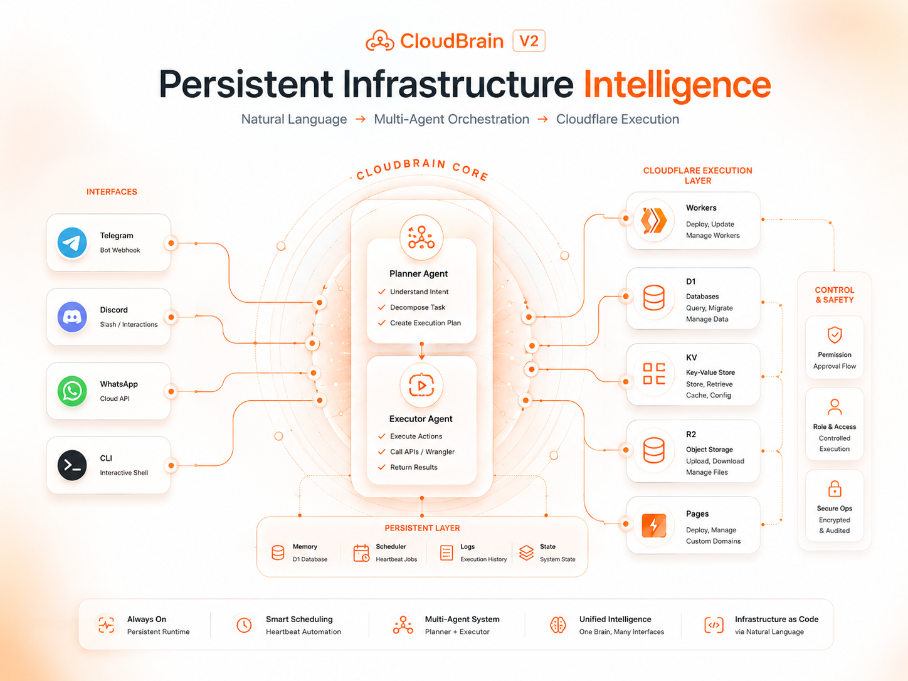

# CloudBrain 2.0

A multi-agent AI system that runs on your VPS and manages your entire Cloudflare infrastructure through natural language. Talk to it via Telegram, Discord, or WhatsApp — or use the CLI directly.

## What It Does

- **Manages Cloudflare** — Workers, KV, D1, R2, DNS, Domains via Wrangler commands
- **Multi-Channel** — Telegram, Discord, WhatsApp + CLI shell
- **AI Powered** — Text, image generation, audio transcription via Workers AI
- **Scheduled Tasks** — Cron-based heartbeat system for recurring automations
- **Web Search** — Real-time search (DuckDuckGo free, Bing optional)
- **Context Aware** — Remembers conversations, stores long-term memory
- **Multi-Agent** — Planner decomposes tasks, Executor handles them with progress updates
- **Permission System** — Asks before destructive operations (approve/always approve/skip)



## Requirements

- Node.js 18+
- MySQL 8+ (local or remote)
- Cloudflare account with API token
- At least one channel: Telegram bot token, Discord bot token, or WhatsApp Cloud API

## Install

```bash
git clone https://github.com/truehannan/cloudbrain.git
cd cloudbrain
npm install
npm link   # Makes 'cloudbrain' command available globally
```

## Setup

```bash
cloudbrain setup
```

This interactive wizard will:
1. Ask for MySQL credentials and connect
2. Ask for Cloudflare Account ID + API Token
3. Ask for channel credentials (Telegram/Discord/WhatsApp)
4. **Automatically create** a D1 database for CloudBrain on Cloudflare
5. **Automatically configure** Workers AI binding
6. Store all resource IDs in local MySQL so the agent knows what belongs to it

## Usage

### Start the Agent

```bash
cloudbrain start
```

Launches the persistent agent. It connects to all configured channels and listens for messages.

### Interactive Shell

```bash
cloudbrain
```

Opens an interactive CLI where you can type commands or natural language.

### Other Commands

```bash
cloudbrain status     # Show system status
cloudbrain tasks      # View scheduled heartbeat tasks
cloudbrain logs       # Stream recent activity logs
cloudbrain channels   # View/manage communication channels
cloudbrain deploy     # Deploy a worker to Cloudflare
cloudbrain setup      # Re-run setup to add/change credentials
```

## What You Can Say

These work identically in Telegram, Discord, WhatsApp, or the CLI shell:

### Cloudflare Management
```
"list my workers"
"list my domains"
"list kv namespaces"
"list my databases"
"list r2 buckets"
"deploy worker my-api"
"create kv namespace cache"
"create database users"
"create bucket media"
"delete worker old-one"
"add dns record A api.example.com 1.2.3.4"
"show worker logs for my-api"
```

### AI Generation
```
"generate image of a sunset over mountains"
"create an image of a logo with blue colors"
"transcribe my voice message"
"write a product description for coffee"
```

### Scheduling (Heartbeat)
```
"send me news at 9am every day"
"run backup at midnight"
"check system status every hour"
"remind me to review reports at 5pm on friday"
```

### Web Search
```
"search for latest AI news"
"look up current bitcoin price"
"find me python tutorials"
```

### Memory
```
"remember that my server IP is 1.2.3.4"
"what did I tell you about the project?"
```

### Multi-Step
```
"create a database called analytics, then deploy a worker that uses it"
```

## Architecture

```
┌──────────────────────────────────────────────────┐
│                    CLI                            │
│    cloudbrain setup | start | shell | status      │
└──────────────────────┬───────────────────────────┘
                       │
┌──────────────────────▼───────────────────────────┐
│              AGENT CORE (index.ts)               │
│    Receives messages → Plans → Executes          │
└─────┬──────────┬──────────┬──────────┬───────────┘
      │          │          │          │
┌─────▼────┐┌───▼────┐┌────▼───┐┌─────▼────┐
│ Channels ││ Agents ││Wrangler││Scheduler │
│Telegram  ││Planner ││Executor││  Cron    │
│Discord   ││Executor││ (CLI)  ││ (MySQL)  │
│WhatsApp  ││        ││        ││          │
└─────┬────┘└───┬────┘└────┬───┘└─────┬────┘
      │         │          │           │
┌─────▼─────────▼──────────▼───────────▼────┐
│              MySQL Database                │
│  credentials | conversations | memories   │
│  scheduled_tasks | task_log | system_config│
└──────────────────────┬────────────────────┘
                       │
         ┌─────────────▼─────────────┐
         │     Cloudflare (Remote)   │
         │  Workers | KV | D1 | R2   │
         │  DNS | Zones | AI | Pages │
         └───────────────────────────┘
```

## How It Works

1. **Message arrives** (Telegram/Discord/WhatsApp/CLI)
2. **Planner Agent** analyzes intent, creates execution plan
3. **Executor Agent** runs subtasks (wrangler commands, AI calls, searches)
4. **Progress updates** sent for multi-step operations
5. **Single response** sent for simple tasks (no spam)
6. **Context stored** in MySQL for future reference
7. **Scheduled tasks** fire automatically via cron and deliver results

## Permission System

Destructive operations (delete worker, drop database, etc.) require approval:

```
CloudBrain: You're asking me to delete worker "old-api". This cannot be undone.

[Approve] [Always Approve] [Skip]
```

- **Approve** — Execute this one time
- **Always Approve** — Never ask again for this type of operation
- **Skip** — Don't execute

## Data Storage

| Data | Where | Why |
|------|-------|-----|
| Credentials | Local MySQL | Never leaves your machine |
| Conversations | Local MySQL | Context for AI |
| Scheduled Tasks | Local MySQL | Survives restarts |
| System Config | Local MySQL | Tracks created resources |
| Permission Rules | Local MySQL | Remembers "always approve" |
| App Data | Cloudflare D1 | Agent's working database |
| Media Files | Cloudflare R2 | On-demand storage |

## Environment Variables (Optional)

You can use a `.env` file instead of `cloudbrain setup` for automation:

```bash
DB_HOST=localhost
DB_PORT=3306
DB_USER=cloudbrain
DB_PASSWORD=your_password
DB_NAME=cloudbrain
```

## Development

```bash
npm run dev        # Run with ts-node (no build needed)
npm run build      # Compile TypeScript to dist/
npm start          # Run compiled version
```

## Previous Version (v1)

The original Cloudflare Workers-based version is archived at commit [`9cd602d`](https://github.com/truehannan/cloudbrain/commit/9cd602d67af39a2981a494e48655f5d0dbe3eb05). That approach was abandoned due to Workers' 30-second execution limit and stateless architecture making persistent agent behavior impossible.

## License

See LICENSE file.
